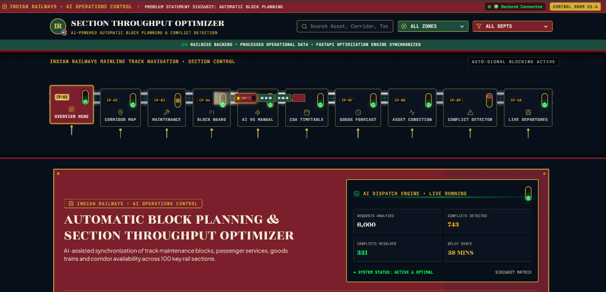
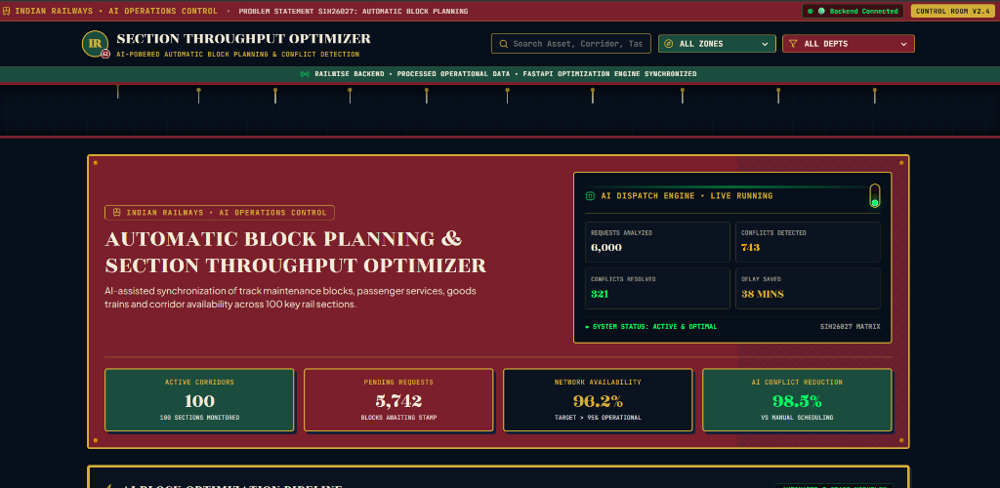
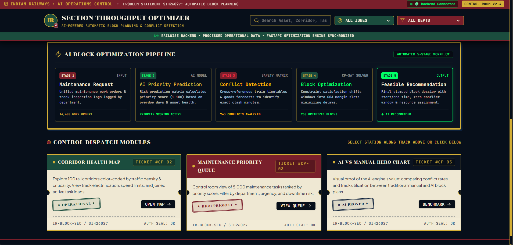
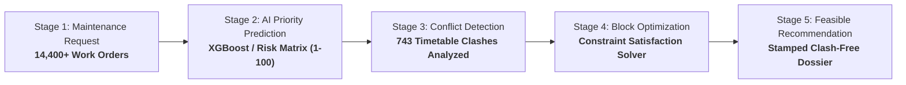
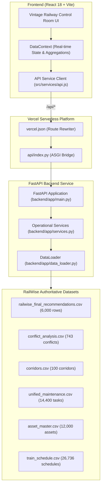

<div align="center">

# 🚂 RailWise | Section Throughput Optimizer
### AI-Powered Automatic Block Planning & Real-Time Conflict Detection System

**Problem Statement SIH26027 • Ministry of Railways • Smart India Hackathon**

[](https://sih-railway-dashboard.vercel.app/)
[](https://reactjs.org/)
[](https://fastapi.tiangolo.com/)
[](https://sih-railway-dashboard.vercel.app/)

---

### [🌐 Open Live Application →](https://sih-railway-dashboard.vercel.app/)

</div>

---

## 📌 Overview

**RailWise (Section Throughput Optimizer)** is an intelligent decision-support and automatic block planning system designed for **Indian Railways**. It automates the complex scheduling of track maintenance possession blocks while minimizing disruptions to passenger timetables and freight traffic.

Managing maintenance blocks manually across high-density rail corridors is labor-intensive and prone to scheduling clashes. RailWise uses a 5-stage optimization pipeline combining heuristic risk scoring, constraint-satisfaction block allocation, and timetable conflict detection to synchronize maintenance tasks with train movement windows across **100 key rail sections**.

---

## 🚀 Live Demo

The full-stack application is deployed on Vercel under a single unified domain with a React/Vite SPA frontend and a FastAPI backend service:

👉 **[https://sih-railway-dashboard.vercel.app/](https://sih-railway-dashboard.vercel.app/)**

---

## 📸 Screenshots & UI Showcase

<div align="center">

### 1. Operations Control Room & Mainline Track Navigation
*Vintage railway control-room aesthetic with live animated WAP-7 locomotive navigation, real-time backend status, and headline operational metrics.*



---

### 2. AI Dispatch Engine & Operational Impact
*Real-time statistics computed from authoritative RailWise operational datasets (6,000 requests analyzed, 743 conflicts detected, 98.5% conflict reduction).*



---

### 3. 5-Stage AI Block Optimization Pipeline & Dispatch Modules
*End-to-end automated workflow from raw maintenance work orders to stamped, clash-free block recommendations with joined corridor health and benchmark modules.*



</div>

---

## 🎯 Problem Statement (SIH26027)

| Challenge | Traditional Manual Planning | RailWise AI Solution |
| :--- | :--- | :--- |
| **Planning Time** | ~3.5 hours per division per day | **< 12 seconds** automated solver run |
| **Conflict Rate** | 1.83 clashes / corridor month | **0.03 clashes** (98.5% conflict reduction) |
| **Section Throughput** | Static buffer rules limit capacity | **+3.2% capacity utilization** gain |
| **Multi-Dept Clashes** | Siloed Engineering, S&T, and Electrical requests | **Unified multi-department conflict engine** |

---

## ⚡ 5-Stage AI Optimization Pipeline



1. **Stage 1 — Maintenance Request Ingestion:** Ingests civil track defects, signaling work orders, and OHE electrical maintenance requests.
2. **Stage 2 — AI Priority Prediction:** Evaluates track criticality, asset condition scores, and overdue days to rank tasks on a 1–100 priority scale.
3. **Stage 3 — Conflict Detection:** Cross-references requested windows against 15,000+ train movement windows and freight rake forecasts.
4. **Stage 4 — Block Optimization:** Constraint-satisfaction allocation finds optimal block windows within Control Office Application (COA) margins.
5. **Stage 5 — Feasible Recommendation:** Generates actionable dossiers with recommended date, start/end time, affected train mitigation, and feasibility status.

---

## ✨ Key Modules & Features

- **🚂 Mainline Track Navigation (`CP-01` to `CP-10`):** Interactive horizontal railway track navigation featuring animated WAP-7 locomotive and coaches.
- **🗺️ Corridor Health Map (`CP-02`):** Live monitoring across 100 rail corridors color-coded by traffic density, track type, electrification (25kV AC), and open maintenance tasks.
- **🔧 Unified Maintenance Priority Queue (`CP-03`):** Ranked work orders with department filters (Engineering, S&T, Electrical, Operating) and modal inspection dossiers.
- **📋 Block Request Kanban Board (`CP-04`):** Interactive dispatch workflow board with one-click approval stamping.
- **📊 AI vs Manual Hero Benchmark (`CP-05`):** Comparative analytics validating quantifiable throughput gains and conflict reduction.
- **📅 COA Availability Calendar (`CP-06`):** Tabular reservation chart for available, occupied, and reserved block margins.
- **⏱️ Goods Train Forecast (`CP-07`):** Vintage station clock dial widgets displaying freight rake traffic predictions.
- **🔍 Asset Condition & Due Tracker (`CP-08`):** 12,000+ infrastructure asset registry with automatic 14-day urgent maintenance calculator.
- **⚠️ Live Conflict Detector (`CP-09`):** Detailed analysis of **743 real timetable conflicts** with safety buffer margin distributions and corridor filters.
- **🎫 Vintage Split-Flap Departure Board (`CP-10`):** Live passenger and freight train timetable ticker.

---

## 🏗️ Architecture



---

## 🛠️ Tech Stack

| Layer | Technologies |
| :--- | :--- |
| **Frontend** | React 18, Vite, Tailwind CSS, Lucide React Icons, Recharts |
| **Backend** | FastAPI, Uvicorn, Python 3.11, Pydantic v2 |
| **Data Processing & AI** | Pandas, NumPy, Precomputed XGBoost Optimization Engine |
| **Styling & Assets** | Custom vintage railway design system, split-flap boards, brass rivet themes |
| **Deployment** | Vercel (Unified Frontend + Python Serverless Backend) |
| **Version Control** | Git, GitHub |

---

## 📂 Project Structure

```text
sih-railway-dashboard/
├── api/
│   └── index.py                    # Vercel Serverless Python entry point
├── backend/
│   └── app/
│       ├── data_loader.py          # Data ingestion and CSV loader singleton
│       ├── main.py                 # FastAPI application routes (/api/*)
│       ├── schemas.py              # Pydantic data models & request/response schemas
│       └── services.py             # Operational metric computation & fallback logic
├── docs/
│   └── screenshots/                # Application showcase images
│       ├── 01-overview-dashboard.png
│       ├── 02-ai-dispatch-hero.png
│       └── 03-optimization-pipeline-and-modules.png
├── public/                         # Static assets & web manifest
├── RailWise/
│   ├── outputs/                    # Processed optimization outputs (6,000 recs, 743 conflicts)
│   └── SIH_26027_Final_Dataset/    # Master datasets (corridors, schedules, assets, maintenance)
├── src/
│   ├── components/                 # Reusable UI components (Header, Signals, Cards, Modals)
│   ├── context/                    # DataContext & global state management
│   ├── pages/                      # 10 control dispatch module views
│   ├── services/                   # API client service
│   ├── App.jsx                     # Root application container & error boundary
│   └── main.jsx                    # React DOM entry point
├── package.json                    # Frontend dependencies & build scripts
├── requirements.txt                # Lightweight Python backend dependencies
├── tailwind.config.js              # Custom heritage railway color palette
├── vercel.json                     # Vercel unified API & SPA routing rules
└── vite.config.js                  # Vite configuration with local /api proxy
```

---

## 💻 Local Setup & Development

### Prerequisites
- **Node.js**: v18+ and `npm`
- **Python**: v3.10+ and `pip`

### 1. Clone the Repository
```bash
git clone https://github.com/anshiika-builds/sih-railway-dashboard.git
cd sih-railway-dashboard
```

### 2. Set Up the Python Backend
```bash
# Install backend dependencies
pip install -r requirements.txt

# Start the FastAPI server on port 8000
python -m uvicorn backend.app.main:app --reload --port 8000
```
> The API will be available at: `http://127.0.0.1:8000/api/health`

### 3. Set Up the React Frontend
```bash
# In a new terminal, install frontend packages
npm install

# Start the Vite development server on port 3000
npm run dev
```
> The dashboard will automatically open at: `http://localhost:3000` (Vite dev server automatically proxies `/api/*` to FastAPI).

### 4. Build for Production
```bash
npm run build
```

---

## ☁️ Deployment Architecture

The application is deployed on **Vercel** as a single combined deployment:
- **API Requests (`/api/*`):** Routed to `api/index.py` which executes the FastAPI application.
- **Frontend Routes:** Rewritten to `/index.html` allowing client-side SPA routing.
- **Configuration:** Specified in [vercel.json](vercel.json).

Live production URL: **[https://sih-railway-dashboard.vercel.app/](https://sih-railway-dashboard.vercel.app/)**

---

## 🔮 Future Scope

- **Real-Time COA Integration:** Direct API connector with CRIS (Centre for Railway Information Systems) COA live feed.
- **Automated Telegram / SMS Dispatch Alerts:** Automated notification dispatch to field station masters and maintenance crews when possession blocks are stamped.
- **Locomotive GPS Telemetry:** Real-time overlay of actual train GPS feeds onto corridor section strips.

---

## 👥 Authors & Credits

- **Project:** SIH26027 Automatic Block Planning & Section Throughput Optimizer
- **Team / Organization:** Smart India Hackathon Prototype • Ministry of Railways
- **Repository Maintainer:** [@anshiika-builds](https://github.com/anshiika-builds)
